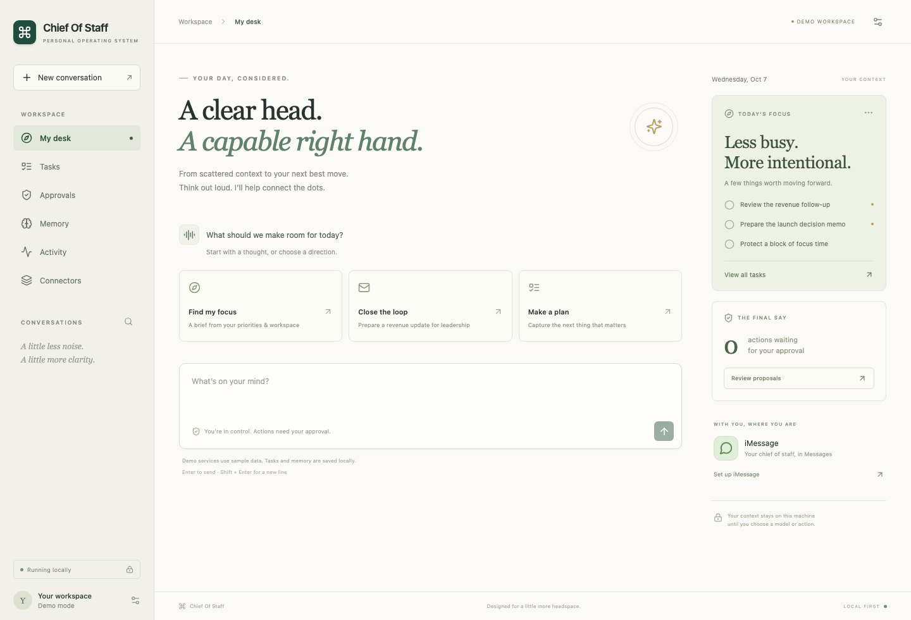
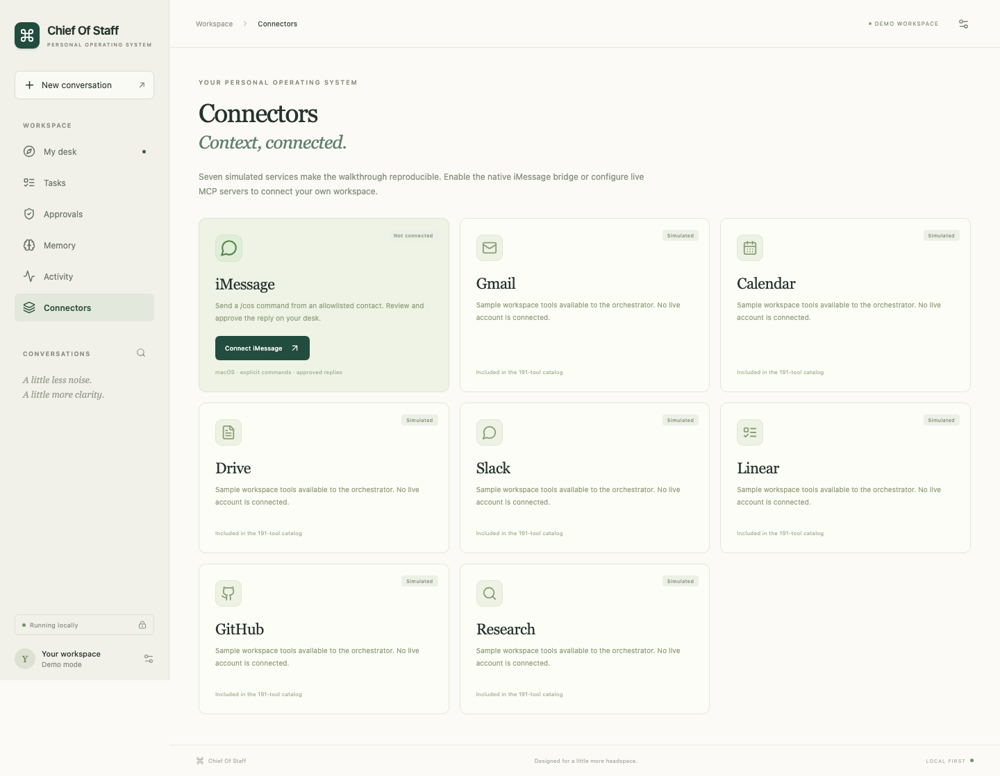
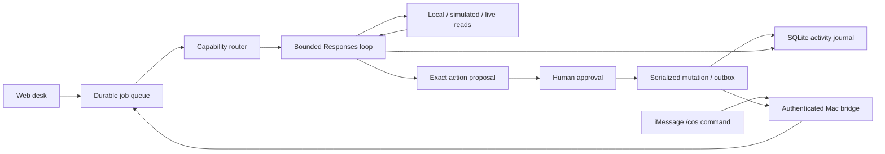

<div align="center">

# Chief Of Staff

### Your day, considered.

A local-first personal assistant that turns scattered context into clear priorities, persistent memory, and actions you can review.

[](https://github.com/shivanshudwivedi/chief-of-staff/actions/workflows/ci.yml)


**[Quick start](#quick-start) · [Five-minute walkthrough](docs/WALKTHROUGH.md) · [iMessage](docs/IMESSAGE.md) · [Live connectors](docs/CONNECTORS.md) · [Architecture](docs/ARCHITECTURE.md)**



</div>

Chief Of Staff gives you one calm place to think, organize, and follow through. Ask for a brief, capture a task, save a preference, or prepare an update across services. The orchestrator discovers relevant tools, executes bounded runs, keeps a concrete activity trail, and asks you to review external changes before they happen.

The web desk is the control center. An optional native macOS bridge lets you use **iMessage as a conversational frontend**: send an allowlisted `/cos` command, inspect the answer on your desk, and approve its outgoing reply.

## What works

| Capability | Behavior |
| --- | --- |
| Conversations | Durable threaded history; background jobs keep the dashboard responsive. |
| Daily briefs | Combines your local priorities with clearly labeled sample workspace lookups. |
| Tasks | Create, prioritize, and complete persistent personal tasks. |
| Memory | Save explicitly requested preferences, use them as context, and forget them from the dashboard. |
| Tool orchestration | Capability routing, mid-run discovery, typed inputs, bounded context, duplicate-call caching, concurrent read batches, and ordered mutations. |
| Approval inbox | Inspect exact arguments; approve or reject a proposal; repeated clicks cannot repeat execution. |
| Activity | Run status, routing groups, tools, inputs, full recorded results, errors, and timing. |
| iMessage | Opt-in read-only polling of new direct commands; allowlisted recipients; reviewed replies; authenticated bridge; deduplicated ingestion. |
| Live MCP | Connect operator-configured Streamable HTTP MCP servers; discover and validate tools; require approval for remote mutations. |
| Reproducible demo | 191 simulated tools across seven services, with no API key needed. |

## Quick start

Requirements: **Python 3.12+**, **Node 20.19+ or 22+**, npm, and [uv](https://docs.astral.sh/uv/getting-started/installation/). The web app works on macOS, Linux, and Windows with Python/npm; the optional bridge requires macOS.

```bash
git clone https://github.com/shivanshudwivedi/chief-of-staff.git
cd chief-of-staff
cp .env.example .env
uv sync --frozen
npm --prefix frontend ci
npm run build
uv run uvicorn backend.app:app --host 127.0.0.1 --port 8000
```

Open **[http://127.0.0.1:8000](http://127.0.0.1:8000)**. On macOS/Linux, `./scripts/start.sh` also builds the UI if needed and starts the server. On Windows, copy `.env.example` using your shell's copy command.

First startup in demo mode seeds three local tasks and one clearly labeled demo preference. SQLite data goes into `data/`, which is excluded from Git. The app binds to loopback and rejects unexpected hosts and browser origins.

### Try it immediately

- **“Brief me on my priorities”** — inspect the local tasks and simulated revenue/issue lookups.
- **“What conversations do I have in Slack?”** — inspect the fixture's channels.
- **“Find revenue emails and post a summary to leadership Slack”** — creates a reviewable simulated posting proposal; open Approvals to approve or reject it.
- **“Add task Prepare the launch memo”** — saves a real local task.
- **“Remember I prefer concise updates”** — saves a preference you can remove under Memory.

Demo mode intentionally supports these flows through deterministic code. It does not pretend to understand arbitrary requests or to access your live email/calendar. The inherited fixture clock is April 8, 2026; this is distinct from the real local clock.

## General assistant mode

Set these values in `.env`, then restart the server:

```dotenv
COS_MODE=openai
OPENAI_API_KEY=your-key
OPENAI_MODEL=gpt-4.1-mini
```

This enables general natural-language requests using the **OpenAI Responses API**, with the same journal, task/memory tools, connector boundary, and approval queue. The model is configurable; choose one that supports Responses function calling in your account. Model-backed runs incur API usage and send prompts, selected context, and tool results to OpenAI. API keys stay on the backend; the UI never asks for them.

The product integration follows the [official function-calling guide](https://developers.openai.com/api/docs/guides/function-calling). The inherited fixture harness is retained for regression coverage; its older Chat Completions loop is separate from the product engine.

### Connect your actual workspace

The seven built-in Gmail, Calendar, Drive, Slack, Linear, GitHub, and Research services are **simulated**. They are not OAuth connections. To access live data, configure your own MCP servers using [the live connector guide](docs/CONNECTORS.md). A runnable local notes MCP server is included to demonstrate real discovery and reviewed writes without an external account.

Remote tools require approval unless their exact names are explicitly configured as read-only. The adapter supports HTTPS Streamable HTTP with optional environment-supplied bearer tokens. It does not implement automatic OAuth sign-in or stdio servers.

## iMessage as your frontend



The macOS bridge is disabled by default. It reads only **new incoming, one-to-one, allowlisted iMessages beginning with `/cos `**, using a read-only Messages database connection. It starts at the newest message and never imports your existing history automatically.

```text
You → /cos Brief me on my priorities
Chief Of Staff → runs the task and prepares a reply
Web desk → review the reply and click Approve action
Mac bridge → submits the approved reply to Messages
```

Follow **[the complete iMessage setup guide](docs/IMESSAGE.md)** for the allowlist, separate bridge token, Full Disk Access, and Automation permissions.

```bash
uv run python bridge/imessage.py --check
uv run python bridge/imessage.py
```

No message is sent during setup validation. Every outgoing message requires dashboard approval. “Accepted” means Messages accepted a send request, not that delivery was confirmed. Uncertain sends are never automatically retried. Group chats, SMS, attachments, and rich-only messages without a plain-text body are unsupported in this version. Native access depends on Apple's Messages database and scripting behavior.

## How a run works



The model sees compact capability cards before tool schemas. Initially it gets at most 45 simulated service tools, seven first-party tools, up to 12 relevant live MCP tools, and `find_tools`. Discovery can expand the simulated set to 60 and live set to 20. A run allows eight execution steps, twelve actual model-requested tool invocations, and an 80-second scheduling budget with bounded provider/connector timeouts. Pure independent read batches overlap; batches containing mutations stay ordered. Identical calls reuse their result within a run.

Approval executes the stored arguments directly. It does not replay the model's entire plan. If a later step depends on an approved result, continue the conversation after reviewing it. Calls that may have partially succeeded are not automatically retried. The journal records execution events; it does not expose hidden model reasoning.

Read [architecture and tradeoffs](docs/ARCHITECTURE.md) for restart handling and implementation details.

## Development and verification

```bash
# Backend regression + product contracts
uv run pytest backend/tests -q

# Product Python checks
uv run ruff check backend/app.py backend/engine.py backend/store.py \
  backend/local_tools.py backend/connectors.py bridge/imessage.py \
  scripts/example_mcp.py backend/tests/test_product.py

# TypeScript + production bundle
npm run build

# Desktop/mobile browser walkthrough
cd frontend
npx playwright install chromium
npm test
```

Verified for this release:

- **118 Python tests passed**, six inherited live-provider tests skipped by default.
- **Two Playwright walkthroughs passed**: end-to-end desktop interactions and mobile layout/navigation.
- A live OpenAI Responses run read tasks and memory and returned a grounded answer.
- A running MCP notes server was discovered and invoked through the real HTTP adapter.
- Native Messages access/sending is **not end-to-end verified**; it requires your Mac's permissions and explicit allowlist. Protocol tests use a synthetic Messages database and never read personal history or send texts.

GitHub Actions repeats the Python checks, production build, and browser walkthrough without API keys or Apple services. For UI development, run the backend on port 8000 and `npm run dev` in a second terminal; Vite proxies API calls.

## Repository map

```text
backend/app.py          Product API, jobs, approvals, bridge authentication
backend/engine.py       Responses orchestration and common execution boundary
backend/store.py        Transactional SQLite journal and persistent context
backend/local_tools.py  Typed tasks, memory, and iMessage tools
backend/connectors.py   Live MCP discovery, validation, and invocation
backend/helpers/        Reused routing taxonomy, schemas, compaction, execution helpers
backend/*_mock/         Seven inherited simulated services (191 tools)
backend/tests/          Inherited regression tests and product contracts
frontend/               React + TypeScript desk and Playwright walkthroughs
bridge/imessage.py      Native Mac reader, cursor, and approved outbound sender
scripts/                Local start, example MCP server, screenshot capture
docs/                   Setup, architecture, screenshots, walkthrough script
```

Start **`backend.app:app`**, as shown above. `backend.main` is the retained fixture harness used by regression tests; it is not the product server and does not implement the product approval boundary.

## Operating boundaries

This is a single-user local application, not a hosted multi-tenant service. Keep it bound to loopback. `COS_API_TOKEN` optionally protects the web API; enter that token through the dashboard's connection settings. The bridge always uses its own required token. Data is not encrypted by the app; rely on your OS disk protection and keep `data/` private. Saved commands, responses, and full tool results remain on disk until removed. There is no scheduled notification service, always-on cloud agent, autonomous third-party texting, or automatic account login in this release.

The inherited candidate code was reused as a foundation rather than represented as newly authored. See [NOTICE](NOTICE) for provenance. Original interview submission documents and personal credentials are not included.
